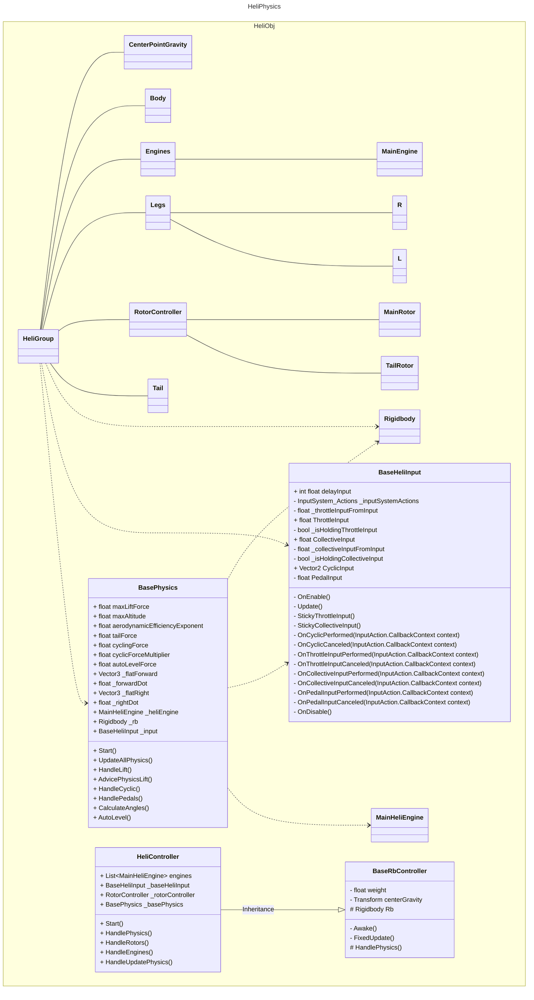

* **ThrottleInput** - ручка газу / Керування потужністю двигуна
* **CollectiveInput** - загальний кут установки лопатей несного гвинта, керування висотою
* **CyclicInput** - Нахиляють ніс вертольота вниз або вгору (рух або гальма). **Pitch** - нахил в ліво або право. **Roll** - наклони вперед та назад
* **PedalInput** - поворот ліво чи право, хвіст Yaw в ТЗ

* **HP** - кінська сила
* **Rpm** - обертальний момент

# Тестове завдання на посаду Unity Developer

**Мета:** Реалізувати фізично коректну модель польоту вертоліта.

**Загальний опис задачі:**  
Потрібно створити невеликий *playable prototype*, у якому користувач може керувати літальним апаратом у 3D-сцені.

---

### 🎯 Основний акцент
*   **Фізика руху** (реалістична поведінка сил).
*   **Керування** (чутливість та відгук).
*   **Стабільність польоту** (система автовирівнювання).
*   **Структура коду** та адекватна архітектура.

---

### 📋 Мінімальні вимоги

#### 1. Основний рух:
*   [x] Зліт
*   [x] Посадка
*   [x] Зависання (Hover)
*   [x] Рух вперед / назад
*   [x] Рух вліво / вправо
*   [x] Поворот по **Yaw** (пеленг)
*   [x] Нахили **Pitch** (тангаж) / **Roll** (крен)

#### 2. Фізика компонентів:
> ⚠️ **Важливо:** Не використовувати готові *flight-controller assets*. Усі розрахунки мають бути чесними.
*   Підйомна сила (*Lift Force*)
*   Тяга (*Thrust*)
*   Гравітація (*Gravity*)
*   Інерція (*Inertia*)
*   Опір повітря (*Drag*)
*   Обертальний момент (*Torque*)

#### 3. Керування (Нова Input System):
*   `W` `A` `S` `D` — Рух (нахили Cyclic)
*   `Space` / `Left Ctrl` — Висота (крок гвинта Collective)
*   `Q` / `E` — Поворот (педалі Yaw)
*   `UpArrow` / `DownArrrow` - кут нахилу леза

---

### 🛠️ Технічні вимоги

*   **Рекомендована версія Unity:** `Unity 6000.2.7f2` (або актуальна версія Unity 6).
*   **Графічний конвеєр:** `HDRP` (High Definition Render Pipeline).
*   **Візуал:** Допускається повна реалізація на 3D-примітивах (куби, сфери, циліндри). Головне — логіка, а не графіка.

---

### ⏱️ Срок виконання
**1 тиждень** з моменту отримання даного завдання.

### 📦 Що потрібно здати:
1. Посилання на публічний **Git-репозиторій** із вихідним кодом проєкту.
2. **Архів з готовим білдом** під Windows / PC для швидкого тестування.

